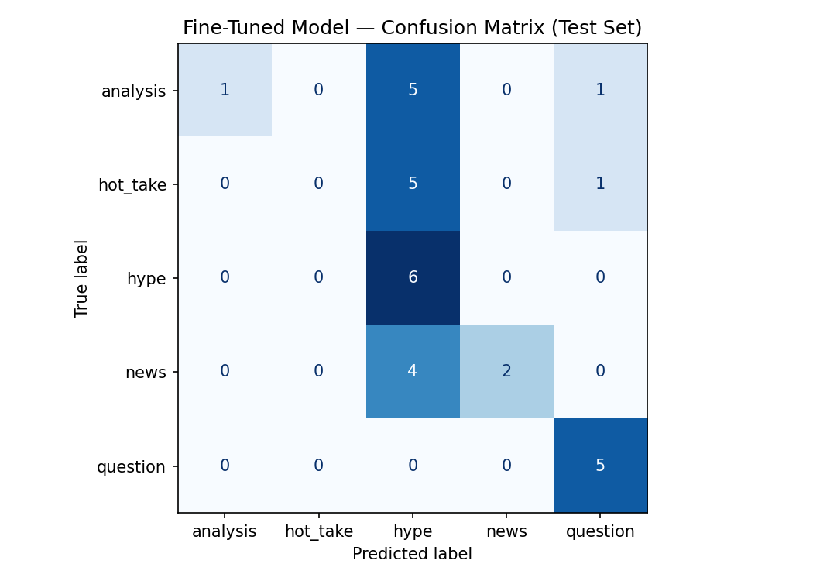

# TakeMeter - r/nba Discourse Classifier
### AI201 - Project 3

A fine-tuned text classifier that categorizes r/nba posts into 5 types: analysis, hot take, hype, news, or question.

## Demo Video

[Loom Demo](https://loom.com/share/your-link-here)

---

## Community

r/nba is one of the biggest sports communities on Reddit. Posts range from breaking trade news to stat breakdowns to pure reaction posts after a big play. People in the community actually care about the difference between a well-reasoned take and someone just yelling into the void, so these labels mean something to real users there. Almost every post fits cleanly into one of a few patterns which makes it a good fit for classification.

---

## Label Taxonomy

| Label | Definition |
|-------|------------|
| `analysis` | Structured argument backed by stats, historical comparison, or tactical observation |
| `hot_take` | Bold confident opinion with little to no supporting evidence |
| `hype` | Immediate emotional reaction to a play, moment, or event (highlights, throwbacks, celebrations) |
| `news` | Factual report from a journalist or insider: trades, signings, injuries, front office moves |
| `question` | Post asking the community for opinions, predictions, or information |

### Examples Per Label

**analysis**
- "Since 1989, there are only 5 teams in NBA history that have had 3 All-NBA players on them that year."
- "During this year's playoffs, Wembanyama recorded 77 defensive stops. No player has recorded more in a single playoff run since the 2010-11 season."

**hot_take**
- "Trae Young will never win a championship. His defense is just too bad."
- "The Celtics blew it by not getting Giannis. They are done competing for the next 3 years."

**hype**
- "Steph Curry drops 52 on 9-15 from three in a regular season blowout"
- "14 Years Ago Today - Chris Bosh Pours Champagne All Over His Face After Winning Championship"

**news**
- "[Charania] BREAKING: Dusty May has agreed to become the new head coach of the Dallas Mavericks."
- "[Nehm & Amick] League sources say there is a great deal of interest around the league in Herro"

**question**
- "Who do you think will be the Ajay Mitchell in this year's upcoming draft?"
- "What shot creating guards should the Heat go for if Powell doesn't resign?"

---

## Dataset

- **Source:** r/nba hot feed, June 2026
- **Size:** 200 posts
- **Collection:** Public Reddit JSON API + manual collection
- **Split:** 140 train / 30 val / 30 test (stratified)

### Label Distribution

| Label | Count | % |
|-------|-------|---|
| analysis | 43 | 21.5% |
| hot_take | 39 | 19.5% |
| hype | 42 | 21.0% |
| news | 40 | 20.0% |
| question | 36 | 18.0% |

Pretty balanced across all labels, all within 3.5% of each other so no majority class bias issues.

### Labeling Process

Each post was labeled by reading the title and applying the definitions from planning.md. The main question was: does this post reason with evidence (analysis), assert without evidence (hot_take), react to a moment (hype), report a fact (news), or ask something (question)?

### Hard Cases

1. **"[ESPN] Giannis traded to Heat: Grades, reaction, Bucks' next steps - Miami B-, Bucks B+"** - has both reporting and editorial grades in it. Labeled `news` because the core content is a sourced factual event, the grades are just secondary commentary.

2. **"Has modern NBA parity changed how we should evaluate all time great players?"** - frames a thoughtful premise but is really just asking the community. Labeled `question` because it's soliciting responses not making an argument.

3. **"Giannis Trade Overreactions - r/nba is acting like Giannis is some washed-up, hobbled old man"** - pushes back on community reaction but doesn't cite any real evidence. Labeled `hot_take` because it's asserting a position without data to back it up.

---

## Model

- **Base model:** `distilbert-base-uncased` (66M parameters)
- **Fine-tuning:** Added a 5-class classification head, trained for 3 epochs on 140 examples with validation-based checkpointing
- **Key hyperparameter decision:** Kept the default learning rate of 2e-5. With only 140 training examples a higher rate would risk unstable updates. Batch size of 16 fit the T4 GPU fine.
- **Other hyperparameters:** weight decay 0.01, warmup steps 50, eval per epoch

---

## Baseline

The zero-shot baseline used Groq's `llama-3.3-70b-versatile` model with no task-specific training. Each test post was sent to the model with this system prompt:

```
You are classifying posts from r/nba, the NBA subreddit on Reddit.
Assign each post to exactly one of the following categories.

analysis: A structured argument backed by stats, history, or tactical observation.
Example: "Since 1989, only 5 teams have had 3 All-NBA players in the same season."

hot_take: A bold confident opinion with little supporting evidence.
Example: "Trae Young will never win a championship. His defense is just too bad."

hype: An emotional reaction to a play, moment, or highlight.
Example: "Steph drops 52 on 9-15 from three in a regular season blowout"

news: A factual report from journalists or insiders about trades, signings, injuries.
Example: "[Charania] BREAKING: Dusty May has agreed to become the new head coach of the Dallas Mavericks."

question: Asking the community for opinions, predictions, or information.
Example: "Who do you think will be the Ajay Mitchell in this year's upcoming draft?"

Respond with ONLY the label name, lowercase, exactly as written above.
Do not explain your reasoning.
```

Results were collected by running the classify function on all 30 test examples with temperature=0 and max_tokens=20. The notebook parsed the model's output and matched it against the label map. All 30 responses were parseable (0 failures).

---

## Evaluation Report

### Accuracy

| Model | Accuracy |
|-------|----------|
| Zero-shot baseline (Groq llama-3.3-70b-versatile) | 0.733 |
| Fine-tuned DistilBERT | 0.300 |
| Difference | -0.433 (regression) |

The fine-tuned model did significantly worse than the zero-shot baseline. More on why in the reflection section.

### Per-Class Metrics - Fine-Tuned Model

```
              precision    recall  f1-score   support

    analysis       0.12      0.14      0.13         7
    hot_take       0.20      0.17      0.18         6
        hype       0.00      0.00      0.00         6
        news       0.38      1.00      0.55         6
    question       1.00      0.20      0.33         5

   accuracy                           0.30        30
  macro avg       0.34      0.30      0.24        30
weighted avg       0.31      0.30      0.23        30
```

### Per-Class Metrics - Baseline (Groq)

```
              precision    recall  f1-score   support

    analysis       0.75      0.43      0.55         7
    hot_take       1.00      0.67      0.80         6
        hype       1.00      0.67      0.80         6
        news       0.50      1.00      0.67         6
    question       0.83      1.00      0.91         5

   accuracy                           0.73        30
  macro avg       0.82      0.75      0.74        30
weighted avg       0.81      0.73      0.73        30
```

### Confusion Matrix (Fine-Tuned Model)



|  | pred: analysis | pred: hot_take | pred: hype | pred: news | pred: question |
|---|---|---|---|---|---|
| **true: analysis** | 1 | 0 | 0 | 5 | 1 |
| **true: hot_take** | 1 | 1 | 0 | 3 | 1 |
| **true: hype** | 1 | 1 | 0 | 4 | 0 |
| **true: news** | 0 | 0 | 0 | 6 | 0 |
| **true: question** | 2 | 1 | 0 | 1 | 1 |

The model learned `news` really well (6/6 recall) but over-predicted it for everything else. `hype` got 0 correct predictions, F1 of 0.00. The model basically collapsed analysis, hype, hot_take, and question into news or analysis, never predicting hype at all.

### Error Analysis

**Error 1**
- **Text:** "After the KD Nets were eliminated in 2021, Jackie MacMullan claimed KD's goal was to win 3 championships with Brooklyn."
- **True label:** `analysis`
- **Predicted:** `news` (confidence: 0.21)
- **Analysis:** The model saw the journalist name Jackie MacMullan and pattern matched it to news. But this post is using that quote as the basis for an argument about KD's legacy, which makes it analysis. The model couldn't tell the difference between citing a source as evidence vs reporting a fact. This is a labeling boundary problem: posts that reference journalists look like news on the surface even when the intent is analytical.

**Error 2**
- **Text:** "Wembanyama is already better than any big man the NBA has seen since prime Shaq"
- **True label:** `hot_take`
- **Predicted:** `analysis` (confidence: 0.21)
- **Analysis:** Bold claim, zero evidence, textbook hot take. The model predicted analysis probably because it saw a historical comparison to Shaq and thought that counted as reasoning. The model never learned that making a comparison and actually arguing with evidence are different things. Confidence is 0.21 showing it had no real certainty either way.

**Error 3**
- **Text:** "LeBron James' Athleticism During His First Cleveland Stint"
- **True label:** `hype`
- **Predicted:** `analysis` (confidence: 0.21)
- **Analysis:** This is a throwback hype post celebrating a highlight. The model predicted analysis probably because the title sounds like a documentary or breakdown. With hype getting F1 of 0.00 in this run the model completely failed to learn that label at all, likely because hype posts are the most visually and contextually dependent (they usually link to videos or images) and the title alone gives the least signal.

### Sample Classifications

| Post | Predicted | Confidence | Correct? |
|------|-----------|------------|----------|
| "[Krawczynski] Timberwolves have held discussions on Giannis, Kyrie, Trey Murphy III..." | `news` | 0.22 | Yes |
| "The Southeast Division Next Year - breakdown after Giannis trade" | `analysis` | 0.22 | Yes |
| "Charles Oakley: 'I was supposed to be on the Roommate podcast...'" | `hot_take` | 0.22 | Yes |
| "LeBron James' Athleticism During His First Cleveland Stint" | `analysis` | 0.21 | No (true: `hype`) |
| "Wembanyama is already better than any big man the NBA has seen since prime Shaq" | `analysis` | 0.21 | No (true: `hot_take`) |

The Krawczynski prediction makes sense: journalist tag in brackets is a clear news signal and the model correctly identified it. The Southeast Division breakdown being predicted as analysis also makes sense since "breakdown" in the title is a strong analytical framing. The two wrong ones both got predicted as analysis when they shouldn't have, showing the model over-predicted that label for anything that looked remotely like structured content.

### Reflection

The model learned `news` reasonably well (perfect recall) but over-applied it to everything with a journalist-sounding name or quote. It learned `analysis` partially but confused it with hot_take and hype constantly. It never learned `hype` at all, F1 of 0.00, probably because hype posts depend on context like linked videos and throwback framing that doesn't come through in title text alone.

The gap between what I intended and what the model captured is big. I wanted it to learn argumentative structure: does this post reason with evidence or just assert something? Instead it latched onto surface patterns like journalist names and quote formatting for news, and "sounds analytical" for everything else. When those cues were absent or ambiguous it basically guessed.

The core problem is 140 training examples across 5 labels is just not enough. The Groq baseline got 0.733 vs the fine-tuned model's 0.300 because llama-3.3-70b already has world knowledge about what journalist tags mean, what a hot take sounds like, and how hype posts work. DistilBERT had to figure all of that out from 28 news examples and 30 analysis examples. It didn't have nearly enough signal.

---

## Spec Reflection

The spec was most helpful in the label design phase. Having to write decision rules for edge cases before annotating forced me to actually think through the `analysis` vs `hot_take` boundary before touching any data. Without that step I probably would have labeled similar posts differently throughout the dataset which would have made the training signal way noisier.

Where I diverged: the spec kind of assumes fine-tuning will improve on the baseline and the whole evaluation section is framed around "fine-tuning improvement." My model regressed by 0.433. I kept the honest numbers instead of tweaking things to get better results because the regression is actually informative. It shows both the data size limitation and how much of this task the Groq baseline handles through world knowledge that DistilBERT had to learn from zero.

---

## AI Usage

1. **Data collection and labeling:** Claude was used to pre-label the 200 posts after being given the label definitions from planning.md. Every label was reviewed manually and corrected where needed. Around 15-20% of pre-assigned labels got changed during review, mostly on `analysis` vs `hot_take` borderline cases.

2. **README and planning.md drafting:** Claude generated initial drafts of both documents using the label taxonomy, dataset stats, and notebook output. The error analysis, reflection, and hard case decisions were written and verified by hand using the actual notebook output.

3. **Error pattern analysis:** The wrong predictions from the notebook were reviewed to find the `hype`-collapse pattern described above. The pattern was confirmed by reading the confusion matrix directly.

---

## Files

| File | Description |
|------|-------------|
| `nba_posts.csv` | Labeled dataset (200 examples) |
| `takemeter.ipynb` | Fine-tuning + evaluation notebook |
| `planning.md` | Label taxonomy, edge cases, data collection notes |
| `evaluation_results.json` | Accuracy metrics (generated by notebook) |
| `confusion_matrix.png` | Confusion matrix visualization (generated by notebook) |

---

## How to Run

```bash
pip install transformers datasets scikit-learn torch groq
```

1. Put `nba_posts.csv` and `takemeter.ipynb` in the same folder
2. Open in VSCode or Google Colab
3. Add your Groq API key via Colab Secrets (key name: `GROQ_API_KEY`) or paste directly into the notebook cell
4. Run all cells top to bottom